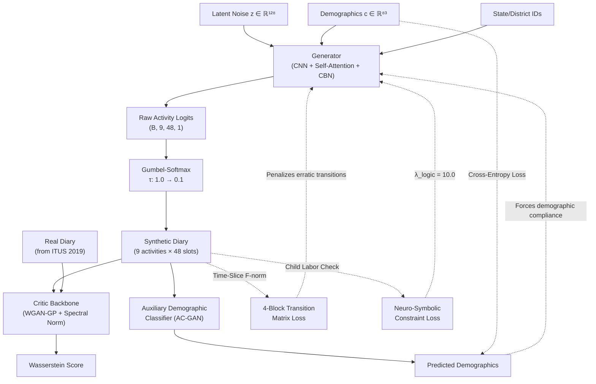
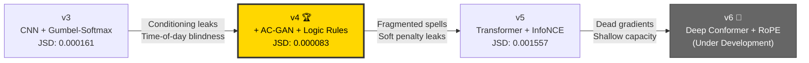

<div align="center">

# 🧬 TUS-GAN

### Conditional Time-Use Diary Synthesis via Generative Adversarial Networks

[](#prerequisites)
[](#prerequisites)
[](LICENSE)
[](#)
[-gold)](#benchmark-results)

> **A state-of-the-art conditional WGAN-GP framework for synthesizing realistic, privacy-preserving 24-hour daily activity diaries conditioned on respondent demographics, trained on the Indian Time Use Survey (ITUS) 2019.**

[Getting Started](#getting-started) · [Interactive Dashboard](#interactive-dashboard) · [Architecture](#architecture-overview) · [Results](#benchmark-results) · [Documentation](#documentation)

</div>

---

## 📖 Introduction

**TUS-GAN** (Time-Use Survey Generative Adversarial Network) generates hyper-realistic synthetic 24-hour daily activity diaries conditioned on individual demographic profiles. Each diary discretizes a full day into **48 half-hour time slots** across **9 major activity divisions** following the International Classification of Activities for Time Use Statistics ([ICATUS 2019](https://unstats.un.org/unsd/gender/timeuse/23012019%20ICATUS.pdf)).

### Why TUS-GAN?

| Problem | TUS-GAN's Solution |
|:---|:---|
| **Privacy Constraints** — raw time-use microdata cannot be freely distributed | Generates unlimited synthetic diaries that are statistically indistinguishable from real respondents |
| **Sample Size Limitations** — surveys are expensive and finite | Produces millions of realistic diaries for simulation and modeling |
| **Temporal Incoherence** — naive generators produce fragmented, erratic schedules | Enforces temporal consistency via transition matrices, spell-duration targeting, and transformer attention |
| **Logical Violations** — generative models can produce physically impossible behaviors | Neuro-symbolic constraints and deterministic logit masking guarantee 0% rule violations (e.g., child labor) |
| **Conditioning Dilution** — deep generators forget input demographics | AC-GAN classifiers and InfoNCE contrastive learning enforce tight demographic–behavior alignment |

### Key Features

- 🎯 **Demographic-Conditional Generation** — synthesize diaries for any combination of age, gender, education, occupation, state, district, and more (83-dimensional conditioning vector)
- 🔒 **Privacy-Preserving** — no real individual's diary is memorized or reproduced
- 📊 **Multi-Version Architecture** — iterative R&D from CNN baselines (v3) through transformer-based models (v5), with v4 achieving the best overall performance
- ⚖️ **Neuro-Symbolic Constraints** — domain rules (child labor laws, physical impossibilities) enforced at the architectural level
- 🖥️ **Interactive Dashboard** — real-time diary generation and visualization via Streamlit
- 📈 **Comprehensive Evaluation** — JSD, F-norm, Spell-Duration EMD, Adversarial ROC-AUC, and logical compliance metrics

---

## 📂 Project Directory Structure

```
tusgan-v3/
├── README.md                       # ← You are here
├── pyproject.toml                  # Project metadata, dependencies & build config
├── requirements.txt                # Minimal pip dependencies
├── dashboard.py                    # 🖥️  Unified Streamlit interactive dashboard
├── performance_summary.png         # Cross-version performance comparison chart
│
├── v3/                             # 🏗️  Baseline: CNN + Gumbel-Softmax + EMA
│   ├── generator.py                #     Generator with CBN, Self-Attention, Gumbel-Softmax
│   ├── critic.py                   #     WGAN-GP Critic with Spectral Norm & CIN
│   ├── train.py                    #     Training loop with global transition loss
│   ├── evaluate.py                 #     Standard evaluation (JSD, F-norm, plots)
│   ├── evaluate_advanced.py        #     Spell-duration EMD & adversarial validation
│   ├── tusgan_encode.npz           #     Pre-encoded ITUS 2019 dataset
│   ├── checkpoints/                #     Saved model weights (.pt files)
│   ├── evaluation_results/         #     Generated evaluation plots
│   └── samples/                    #     Epoch-level sample snapshots (.npy)
│
├── v4/                             # 🏆  Best Model: AC-GAN + Time-Slice Loss + Logic Rules
│   ├── generator.py                #     Same backbone, refined for AC-GAN integration
│   ├── critic.py                   #     Critic with AC-GAN auxiliary classifier
│   ├── train.py                    #     + DemographicClassifier, neuro-symbolic loss
│   ├── evaluate.py                 #     Standard evaluation pipeline
│   ├── evaluate_advanced.py        #     + Logical constraint violation analysis
│   ├── evaluate_optimized.py       #     Truncation trick + rejection sampling (0% violations)
│   ├── tusgan_encode.npz           #     Pre-encoded ITUS 2019 dataset
│   ├── checkpoints/                #     Saved model weights (.pt files)
│   ├── evaluation_results/         #     Generated evaluation plots
│   └── samples/                    #     Epoch-level sample snapshots (.npy)
│
├── v5/                             # 🔬  Experimental: Transformer + InfoNCE + Hard Masking
│   ├── generator.py                #     Transformer backbone + positional encoding
│   ├── critic.py                   #     Transformer critic + temporal pooling + InfoNCE head
│   ├── train.py                    #     + Spell-duration loss, deterministic logit masking
│   ├── evaluate_ultimate.py        #     All-in-one comprehensive evaluation suite
│   ├── smoke_test.py               #     Structural validation & gradient flow checks
│   ├── code_reveiw.md              #     Code review notes & fixes applied
│   ├── v5_fix_plan.md              #     Planned fixes for v5 issues
│   ├── tusgan_encode.npz           #     Pre-encoded ITUS 2019 dataset
│   ├── checkpoints/                #     Saved model weights
│   ├── evaluation_v5_100k/         #     100k-sample evaluation results
│   ├── results/                    #     Additional result artifacts
│   └── samples/                    #     Epoch-level sample snapshots
│
├── v6/                             # 🚧  Under Development (not yet trained)
│   ├── generator.py                #     Deep Conformer + RoPE + hybrid constraints
│   ├── critic.py                   #     Deep transformer critic
│   ├── train.py                    #     Hybrid soft/hard constraint training
│   ├── evaluate_ultimate.py        #     Evaluation suite
│   └── smoke_test.py               #     Structural smoke tests
│
├── docs/                           # 📚  Reference documents
│   ├── 3-digit-activity.pdf        #     ICATUS 2019 3-digit activity classification
│   ├── State_District_List_TUS.pdf #     State & district code mappings
│   └── Statediistname.csv          #     State/district name lookup table
│
├── tusgan-v3.md                    # 📝  v3 architecture & results documentation
├── tusgan-v4.md                    # 📝  v4 architecture & results documentation
├── tusgan-v5.md                    # 📝  v5 architecture & results documentation
├── tusgan-v6.md                    # 📝  v6 architecture & design documentation
├── DEVELOPMENT_LEDGER.md           # 📋  Full chronological change ledger
├── development_ledger.md           # 📋  Supplementary development notes
└── logging.md                      # 📋  Semantic logging system documentation
```

---

<h2 id="getting-started">🚀 Getting Started</h2>

### Prerequisites

| Requirement | Version |
|:---|:---|
| Python | ≥ 3.9 |
| PyTorch | ≥ 2.0 |
| CUDA (optional) | ≥ 11.7 (for GPU training) |

### Installation

<details>
<summary><strong>Option 1 — pip install (recommended)</strong></summary>

```bash
# Clone the repository
git clone https://github.com/venkat-nallapu/tusgan.git
cd tusgan

# Create and activate virtual environment
python -m venv .venv
source .venv/bin/activate        # Linux/macOS
# .venv\Scripts\activate         # Windows

# Install all dependencies
pip install -e .
```

</details>

<details>
<summary><strong>Option 2 — requirements.txt (lightweight)</strong></summary>

```bash
git clone https://github.com/venkat-nallapu/tusgan.git
cd tusgan

python -m venv .venv
source .venv/bin/activate

pip install -r requirements.txt
```

</details>

<details>
<summary><strong>Option 3 — Dev dependencies (linting, testing)</strong></summary>

```bash
pip install -e ".[dev]"
```

This adds `pytest`, `black`, `isort`, and `flake8` for development workflows.

</details>

### Quick Verification

```bash
# Verify PyTorch and CUDA availability
python -c "import torch; print(f'PyTorch {torch.__version__}, CUDA: {torch.cuda.is_available()}')"

# Run v5 smoke tests (validates model architecture & gradient flow)
python v5/smoke_test.py
```

---

<h2 id="interactive-dashboard">🖥️ Interactive Dashboard</h2>

The unified Streamlit dashboard lets you generate individual daily diaries in real-time, visualize activity schedules, and browse pre-computed evaluation results across all model versions.

```bash
# Activate your virtual environment first
source .venv/bin/activate

# Launch the dashboard
streamlit run dashboard.py
```

**Dashboard Features:**

| Feature | Description |
|:---|:---|
| 🎛️ **Demographic Controls** | Set age, gender, marital status, education, occupation, day of week, sector, state & district |
| 🔄 **Version Switching** | Toggle between v3, v4, v5, and v6 models from the sidebar |
| 🌡️ **Gumbel Temperature** | Fine-tune the sharpness of categorical decisions in real-time |
| 📊 **Diary Visualizations** | Color-coded timeline strip, step plot with activity shading, and time breakdown table |
| 📈 **Evaluation Gallery** | Auto-discovers and displays all evaluation plots from `evaluation_results/` |

---

<h2 id="architecture-overview">🏗️ Architecture Overview</h2>

TUS-GAN follows the **Wasserstein GAN with Gradient Penalty (WGAN-GP)** framework, extended with conditional generation, auxiliary classification, and neuro-symbolic constraints.

### Core Data Flow (v4 — Best Model)



### 9 ICATUS Activity Divisions

| Code | Division | Color | Examples |
|:---:|:---|:---:|:---|
| 1 | Employment & Related Activities | 🟠 | Paid work, commuting to work |
| 2 | Production for Own Final Use | 🟤 | Farming, construction for household |
| 3 | Unpaid Domestic Services | 🟢 | Cooking, cleaning, laundry |
| 4 | Unpaid Caregiving Services | 🔴 | Childcare, eldercare |
| 5 | Unpaid Volunteer & Community Work | 🟣 | Community service, volunteering |
| 6 | Learning & Education | 🔵 | School, college, homework |
| 7 | Socializing & Religious Practice | 🩷 | Temple visits, socializing |
| 8 | Culture, Leisure & Sports | 🫒 | TV, sports, hobbies |
| 9 | Self-care & Maintenance | 🔷 | Sleep, eating, personal hygiene |

### Conditioning Vector (83 dimensions)

The demographic conditioning vector encodes:

- **Age Group** (7 bins): `<15`, `15-17`, `18-24`, `25-34`, `35-44`, `45-59`, `60+`
- **Gender** (3 categories): Male, Female, Transgender
- **Marital Status** (4 categories): Married, Widowed, Divorced/Separated, Never Married
- **Education Level** (12 tiers): From "Not Literate" to "Diploma/Graduate+"
- **Principal Activity Status** (13 codes): Employment types, student, domestic duties, etc.
- **Day of Week** (7): Monday through Sunday
- **Sector** (2): Rural, Urban
- **Household Size** (binned)
- **Monthly Per-Capita Expenditure** (binned)
- **State Embedding** (8-dim learned): 36 states/UTs
- **District Embedding** (16-dim learned): 71 districts

---

<h2 id="benchmark-results">🏆 Benchmark Results</h2>

### Cross-Version Performance Comparison

> **v4 is the current best-performing model**, achieving the optimal balance between statistical realism, temporal coherence, and logical compliance.

| Metric | v3 | v4 🏆 | v5 | Target |
|:---|:---:|:---:|:---:|:---:|
| **JSD** ↓ | 0.000161 | **0.000083** ✅ | 0.001557 | < 0.00010 |
| **Transition F-norm** ↓ | 0.0618 | 0.1633 | 0.2736 | Lower is better |
| **Adversarial AUC-ROC** ↓ | 0.7970 | **0.7225** ✅ | 0.7421 | → 0.500 |
| **Adversarial Accuracy** ↓ | 72.75% | **65.47%** ✅ | 67.42% | → 50% |
| **Child Labor Violations** ↓ | ~5.20% | **0.30%** ✅ | **0.00%** ✅ | 0.00% |
| **Logical Guarantee** | ❌ None | ⚠️ Soft penalty | ✅ Hard mask | Structural |
| **0% at Inference** | ❌ | ✅ (rejection) | ✅ (masking) | ✅ |

> **Reading the table:** ↓ means lower is better. v4 achieves the best JSD (population-level accuracy) and the hardest-to-distinguish synthetic sequences (lowest AUC-ROC), while maintaining near-zero logical violations. v5 achieves perfect structural compliance but at the cost of statistical degradation.

### Spell-Duration EMD (Wasserstein Distance) — v4

| Activity | EMD ↓ | Interpretation |
|:---|:---:|:---|
| Self-care & Maintenance | **0.1434** | Excellent — sleep/wake patterns match closely |
| Unpaid Domestic Services | **0.1356** | Excellent — household activity blocks are realistic |
| Socializing & Religious | **0.2351** | Good — social event durations are well-modeled |
| Unpaid Caregiving | **0.2723** | Good — caregiving spell lengths align |
| Employment & Related | **0.8702** | Moderate — long work shifts remain challenging |

### Training Configuration

| Parameter | v3 | v4 | v5 |
|:---|:---:|:---:|:---:|
| Backbone | CNN | CNN | Transformer |
| Epochs | 350 | 250 | 300 |
| Batch Size | 1024 | 512 | 512 |
| Critic Steps/Gen Step | 5 | 5 | 5 |
| Learning Rate | 1e-4 | 1e-4 | 1e-4 |
| Optimizer | Adam (β₁=0, β₂=0.9) | Adam (β₁=0, β₂=0.9) | Adam (β₁=0, β₂=0.9) |
| LR Schedule | Cosine Annealing | Cosine Annealing | Cosine Annealing |
| EMA Decay | 0.999 | 0.999 | 0.999 |
| GPU | NVIDIA A100 | NVIDIA A100 | Kaggle Dual-GPU |

---

## 💻 Usage

### Training a Model

<details>
<summary><strong>Train v3 (Baseline)</strong></summary>

```bash
python v3/train.py \
    --data v3/tusgan_encode.npz \
    --epochs 350 \
    --batch 1024
```

</details>

<details>
<summary><strong>Train v4 (Recommended)</strong></summary>

```bash
python v4/train.py \
    --data v4/tusgan_encode.npz \
    --epochs 250 \
    --batch 512 \
    --lambda_cond 1.0 \
    --lambda_logic 10.0
```

</details>

<details>
<summary><strong>Train v5 (Transformer)</strong></summary>

```bash
python v5/train.py \
    --epochs 300 \
    --batch 512
```

> ⚠️ v5 automatically disables Flash/Memory-Efficient SDP attention to permit WGAN-GP's second-order gradient penalty.

</details>

### Evaluating a Trained Model

```bash
# Standard evaluation (JSD, F-norm, plots)
python v4/evaluate.py --checkpoint v4/checkpoints/final.pt

# Advanced evaluation (Spell-Duration EMD, Adversarial ROC-AUC, Logical Violations)
python v4/evaluate_advanced.py --checkpoint v4/checkpoints/final.pt

# Optimized inference with truncation trick + rejection sampling (guarantees 0% violations)
python v4/evaluate_optimized.py --checkpoint v4/checkpoints/final.pt
```

### Monitoring Training

```bash
# Launch TensorBoard to visualize losses, gradients, and generated heatmaps
tensorboard --logdir v4/runs/
```

---

## 📊 Evaluation Metrics Explained

<details>
<summary><strong>Jensen-Shannon Divergence (JSD)</strong></summary>

Measures the divergence between the **macro-population activity distributions** of real and synthetic datasets. A JSD near 0 means the overall percentage of time spent on each activity perfectly matches the real population.

$$\text{JSD}(P \| Q) = \frac{1}{2} D_{KL}(P \| M) + \frac{1}{2} D_{KL}(Q \| M), \quad M = \frac{1}{2}(P + Q)$$

</details>

<details>
<summary><strong>Transition Matrix Frobenius Norm (F-norm)</strong></summary>

Compares the **activity-to-activity transition probabilities** between real and synthetic diaries. Lower F-norm indicates that the temporal sequencing of activities (e.g., "Sleep → Commute → Work") matches real-world patterns.

$$\|P_{\text{fake}} - P_{\text{real}}\|_F = \sqrt{\sum_{i,j} (p^{\text{fake}}_{ij} - p^{\text{real}}_{ij})^2}$$

</details>

<details>
<summary><strong>Spell-Duration EMD (Earth Mover's Distance)</strong></summary>

Measures whether the **contiguous block lengths** (spells) of each activity are realistic. For example, real sleep spells average ~8 hours; if the model produces fragmented 30-minute sleep bursts, the EMD will be high.

</details>

<details>
<summary><strong>Adversarial Validation AUC-ROC</strong></summary>

Trains a Random Forest classifier to distinguish real from synthetic diaries. An AUC-ROC of 0.50 means the classifier can't tell them apart (perfect). Our best model (v4) achieves 0.72, meaning synthetic diaries are hard but not impossible to distinguish.

</details>

<details>
<summary><strong>Logical Violation Rate</strong></summary>

Percentage of generated diaries that violate hard domain rules — primarily **child labor violations** (employment activity for respondents aged < 15). v4 achieves 0.30% during training and 0.00% with rejection sampling at inference.

</details>

---

## 📘 Dataset: Indian Time Use Survey (ITUS) 2019

| Property | Value |
|:---|:---|
| **Source** | National Sample Survey Office (NSSO), Ministry of Statistics & Programme Implementation (MoSPI), India |
| **Survey Year** | January – December 2019 |
| **Coverage** | All 36 States and Union Territories of India |
| **Encoding Format** | `tusgan_encode.npz` (NumPy compressed archive) |

### Dataset Arrays

| Array Key | Shape | Dtype | Description |
|:---|:---|:---|:---|
| `diary_tensor` | `(N, 9, 48, 1)` | float32 | One-hot encoded activity diaries |
| `cond_vector` | `(N, 83)` | float32 | Demographic conditioning features |
| `district_ids` | `(N,)` | int64 | Zero-indexed district identifiers (0–70) |
| `state_ids` | `(N,)` | int64 | Zero-indexed state identifiers (0–35) |
| `num_districts` | scalar | int | Total unique districts (71) |
| `num_states` | scalar | int | Total unique states (36) |

---

<h2 id="documentation">📝 Documentation</h2>

### Version-Specific Architecture Documentation

| Version | Document | Status | Highlights |
|:---|:---|:---:|:---|
| **v3** | [tusgan-v3.md](tusgan-v3.md) | ✅ Stable | Gumbel-Softmax, EMA, Global Transition Loss |
| **v4** | [tusgan-v4.md](tusgan-v4.md) | 🏆 Best | AC-GAN, Time-Slice Transitions, Neuro-Symbolic Logic |
| **v5** | [tusgan-v5.md](tusgan-v5.md) | ⚠️ Experimental | Transformers, InfoNCE, Deterministic Logit Masking |
| **v6** | [tusgan-v6.md](tusgan-v6.md) | 🚧 In Development | Deep Conformer, RoPE, Hybrid Constraints |

### Development & Change Tracking

| Document | Description |
|:---|:---|
| [DEVELOPMENT_LEDGER.md](DEVELOPMENT_LEDGER.md) | Full chronological record of all architectural changes, training runs, and benchmark results |
| [development_ledger.md](development_ledger.md) | Supplementary code review fixes and implementation notes |
| [logging.md](logging.md) | Documentation of the semantic change ledger system |

### Reference Materials (in `docs/`)

| File | Description |
|:---|:---|
| [3-digit-activity.pdf](docs/3-digit-activity.pdf) | ICATUS 2019 full 3-digit activity classification reference |
| [State_District_List_TUS.pdf](docs/State_District_List_TUS.pdf) | Official ITUS state and district code mappings |
| [Statediistname.csv](docs/Statediistname.csv) | Machine-readable state/district name lookup table |

---

## 🔬 Version Evolution

The project follows an iterative research methodology, with each version addressing specific shortcomings of its predecessor:



<details>
<summary><strong>🔍 Detailed version changelog</strong></summary>

### v3 → v4 Improvements
- **Added** Decoupled AC-GAN Demographic Classifier to prevent conditioning dilution
- **Replaced** global transition matrix with **4 time-slice transition matrices** (Morning/Afternoon/Evening/Night)
- **Introduced** Neuro-Symbolic Constraint Loss to enforce child labor law compliance
- **Added** adaptive Gumbel temperature annealing based on JSD performance tracking
- **Result**: JSD improved from 0.000161 → **0.000083**, Adversarial AUC dropped from 0.797 → **0.722**

### v4 → v5 Changes
- **Replaced** CNN backbone with Temporal Transformer Encoder blocks
- **Replaced** AC-GAN with InfoNCE Contrastive Learning for demographic entanglement
- **Added** Differentiable Spell-Duration Loss targeting realistic activity block lengths
- **Added** Deterministic Logit Masking (`-1e9`) for absolute 0% logical violations
- **Tradeoff**: Perfect compliance but degraded JSD (0.000083 → 0.001557) due to dead gradients

### v5 → v6 Design (In Progress)
- **Scaled** Transformer depth from 2 → 6 layers, attention heads from 4 → 8
- **Replaced** absolute positional embeddings with Rotary Positional Embeddings (RoPE)
- **Re-introduced** soft Neuro-Symbolic penalty alongside hard masking (hybrid constraints)
- **Reduced** InfoNCE weight from 0.5 → 0.1 to restore adversarial training dominance

</details>

---

## 🧪 Reproducibility

To reproduce the v4 benchmark results:

```bash
# 1. Activate environment
source .venv/bin/activate

# 2. Train for 250 epochs on A100 GPU
python v4/train.py \
    --data v4/tusgan_encode.npz \
    --epochs 250 \
    --batch 512 \
    --lambda_cond 1.0 \
    --lambda_logic 10.0

# 3. Evaluate with 10,000 samples
python v4/evaluate.py \
    --checkpoint v4/checkpoints/final.pt \
    --n-samples 10000

# 4. Run advanced evaluation (EMD + Adversarial + Logic)
python v4/evaluate_advanced.py \
    --checkpoint v4/checkpoints/final.pt

# 5. Run optimized inference (truncation + rejection sampling)
python v4/evaluate_optimized.py \
    --checkpoint v4/checkpoints/final.pt
```

**Expected hardware:** Training was conducted on NVIDIA A100 (MIG partition). A GPU with ≥ 16 GB VRAM is recommended.

---

## 🤝 Contributing

Contributions are welcome! Here's how you can help:

1. **Fork** the repository
2. **Create** a feature branch (`git checkout -b feature/amazing-improvement`)
3. **Follow** the existing code style (`black` formatting, `isort` imports)
4. **Add** entries to `DEVELOPMENT_LEDGER.md` documenting your changes
5. **Submit** a Pull Request with a clear description

### Development Setup

```bash
# Install dev dependencies
pip install -e ".[dev]"

# Format code
black --line-length 100 .
isort --profile black --line-length 100 .

# Lint
flake8 .
```

---

## 📜 Citation

If you use TUS-GAN in your research, please cite:

```bibtex
@software{tusgan2026,
  author       = {Venkat Nallapu},
  title        = {{TUS-GAN}: Conditional Time-Use Diary Synthesis via Generative Adversarial Networks},
  year         = {2026},
  url          = {https://github.com/venkat-nallapu/tusgan},
  note         = {Trained on Indian Time Use Survey (ITUS) 2019}
}
```

---

## 📄 License

This project is licensed under the **MIT License** — see the [pyproject.toml](pyproject.toml) for details.

---

<div align="center">

**to be continued(sequal soon) ...**

[⬆ Back to Top](#)

</div>

