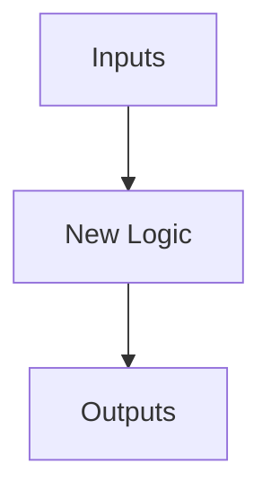

# Tusgan-v2 Smart Logging System

Welcome to the **Semantic Change Ledger** for `tusgan-v2`. Instead of traditional flat-text changelogs or standard commit logs, we use a structured, explanatory, and visually rich **Development & Change Ledger** (`DEVELOPMENT_LEDGER.md`) combined with an automation script to record changes and explain the code cleanly.

---

## 🌟 The Core Concept: Semantic Change Ledger

Traditional logging is often either too sparse (like git commits) or too noisy (like line-by-line diffs). Our new technique introduces **Self-Explaining Ledgers**:
1. **Categorized Entries**: Every change is tagged with a clear domain (e.g., `Architecture 🏗️`, `Data Pipeline 📊`, `Training 👟`, `UI/UX 🎨`).
2. **Visual Impact Maps**: Uses Mermaid diagrams to show how the codebase flow changes.
3. **The "Why" & "How" Explanations**: Deep explanations of the code changes, outlining target files and logic.
4. **Interactive Carousels/Cards**: Standardized markdown blocks with clear collapsible sections.

---

## 🛠️ How It Works (The Automation Tool)

To log a change, run the interactive tool located at `scratch/log_change.py`. This script:
- Scans files modified in Git.
- Asks you what kind of change was made.
- Lets you explain the code logic cleanly.
- Automatically appends a beautifully structured card to [DEVELOPMENT_LEDGER.md](file:///home/venkat/projects/tusgan-v2/DEVELOPMENT_LEDGER.md).

### Running the Logger
```bash
python scratch/log_change.py
```

---

## 📖 Ledger Entry Structure

Every log entry in [DEVELOPMENT_LEDGER.md](file:///home/venkat/projects/tusgan-v2/DEVELOPMENT_LEDGER.md) follows this format:

```markdown
### 🗓️ [YYYY-MM-DD HH:MM] - [Brief Summary of Change]
> [!NOTE]
> **Category**: `Architecture` | `UI` | `Data` | `Training`  
> **Author**: Developer / AI Assistant

#### 🎯 Intent & Impact
Explain the problem this change solves and what parts of the system are affected.

#### 🛠️ Code Modification Details
List the modified files and explain the code changes. For example:
- **[generator.py](file:///home/venkat/projects/tusgan-v2/wgan-gp/generator.py)**: Explain what was changed (e.g., added a new Conditional Batch Normalization layer).

#### 🧬 Architectural Flow Change (Optional)

```

This system makes onboarding and tracking extremely clean and visual, bridging the gap between Git history and code documentation.
