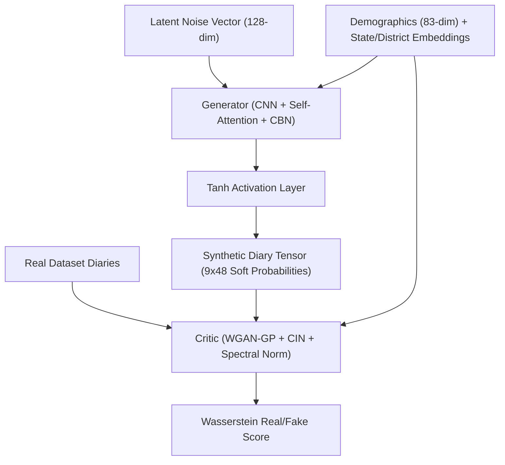

# TUS-GAN v2: 9-Channel One-Hot & Dual Geographic Conditioning

## 🛑 Setbacks in Previous Version (v1)
- **Discontinuous Integer Representations:** The initial baseline (v1) generated a single continuous integer or 1D code per 30-minute time slot. Neural networks struggle to optimize over discrete, non-differentiable step boundaries, creating harsh quantization artifacts and instability during training.
- **Geographic Conditioning Blindness:** Early iterations relied solely on macro demographic variables (Age, Gender, Marital Status) without spatial context. As a result, the model failed to capture state- and district-level time-use variations across India.
- **Mode Collapse & Temporal Disconnect:** Standard CNN layers lacked a global temporal receptive field, leading to severe mode collapse where morning commute behaviors had no mathematical correlation with evening routines.

## 🚀 What's New in this Version [Proposed Features & Add-ons]
- **9-Channel One-Hot Output Representation:** Instead of scalar integer slots, the Generator outputs a `(9, 48)` tensor representing the 9 Major ICATUS Activity Divisions across 48 half-hour slots.
- **Hierarchical Dual Geographic Embeddings:** Added learned embedding layers for both **State ID** and **District ID** concatenated directly into the demographic conditioning pipeline.
- **Self-Attention Mechanism (`SelfAttention2d`):** Integrated 2D self-attention modules into both the Generator and Critic to model long-range temporal correlations across the 24-hour cycle.
- **Conditional Normalization & Lipschitz Enforcement:** Implemented Conditional Batch Normalization (**CBN**) in the Generator and Conditional Instance Normalization (**CIN**) with Spectral Normalization in the Critic to enforce strict 1-Lipschitz continuity for WGAN-GP.

## 🏗️ Technical Architectures

The v2 architecture establishes the fundamental multi-channel conditional WGAN-GP pipeline with spatial attention and geographic embedding layers.

### System Mapping & Data Flow

### Component Details
- **Generator Network:** 
  - *Architecture:* Uses a sequence of `UpsampleBlock` layers (using `ConvTranspose2d`) upscaling temporal dimension from 12 → 24 → 48. Employs Conditional Batch Normalization (CBN) modulated by fused demographic + geographic condition vectors.
  - *Self-Attention:* Incorporates a `SelfAttention2d` layer between upsampling stages to correlate distant temporal slots (e.g. morning vs. evening commute).
  - *Output:* Applies a final `Tanh` activation function, outputting a $(B, 9, 48, 1)$ soft continuous tensor.
- **Critic Network:**
  - *Architecture:* Built with stacked `DownsampleBlock` layers using `Conv2d` and Conditional Instance Normalization (CIN).
  - *Regularization:* Applies Spectral Normalization to all convolutional layers to strictly enforce 1-Lipschitz continuity for WGAN-GP gradient penalty stability.
  - *Scoring:* Fuses demographic conditions into CIN layers and outputs an unbounded scalar Wasserstein real/fake score.

## 💻 Execution Pipelines
- **Model Training:** `python wgan-gp/train.py --data tusgan_encode.npz --epochs 200 --batch 128 --n_critic 5`
- **Statistical Evaluation:** `python wgan-gp/evaluate.py --checkpoint checkpoints/final.pt --n-samples 10000`
- **Interactive Dashboard:** `streamlit run dashboard.py`

## 🏆 Final Training Results
- **Jensen-Shannon Divergence (JSD):** `0.002840` (Established baseline population-level statistical alignment).
- **Wasserstein Distance Stability:** WGAN-GP loss converged smoothly without mode collapse, validating the 9-channel one-hot representation.
- **Remaining Limitation:** Soft `Tanh` outputs created continuous approximation mismatch at inference time (addressed in v3 via Gumbel-Softmax).
