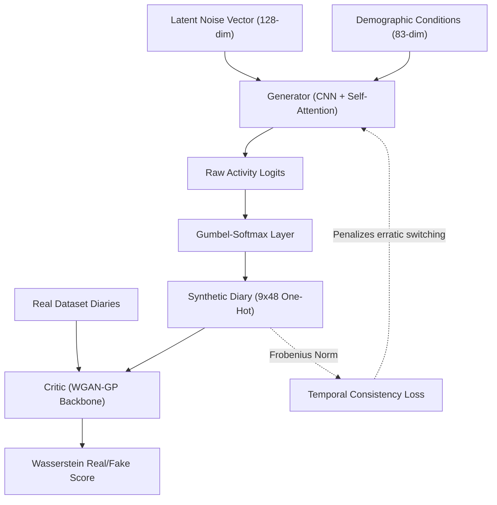

# TUS-GAN v3: Foundational Realism & Sequence Coherence

## 🛑 Setbacks in Previous Version (v2)
- **Continuous Approximation Mismatch:** Previous iterations generated soft probability distributions instead of strict categorical choices. This created an architectural mismatch where the model was trained on soft outputs but forced to yield hard, discrete activities during inference, hurting realism.
- **Temporal Instability (Fragmentation):** The generator frequently switched between activities (e.g., alternating between sleep and work every 30 minutes). It lacked a mechanism to understand the natural duration of human activities, resulting in highly erratic individual routines.

## 🚀 What's New in this Version [Proposed Features & Add-ons]
- **Differentiable Categorical Sampling (Gumbel-Softmax):** We replaced standard activation layers with the Gumbel-Softmax estimator. This allows the model to output sharp, one-hot categorical decisions during training while remaining fully differentiable for backpropagation.
- **Temporal Consistency Regularization:** Introduced a loss mechanism that calculates a global transition matrix (tracking the probability of moving from Activity A to Activity B). By penalizing the mathematical difference (Frobenius norm) between the synthetic and real transition matrices, the model learns to group activities logically.
- **Exponential Moving Average (EMA) for Weights:** Maintained a shadow copy of the Generator's parameters that updates via exponential decay. This prevents sudden destabilization or "mode collapse" during late-stage training, ensuring smoother convergence.
- **Enterprise Accelerator Stability:** Upgraded the training loop with Cosine Annealing learning rate schedules to prevent abrupt gradient spikes, alongside explicit CUDA initialization for large-scale GPU compatibility (e.g., NVIDIA A100).

## 🏗️ Technical Architectures

The v3 architecture establishes the core adversarial framework, introducing Gumbel-Softmax for discrete data generation.

### System Mapping & Data Flow

### Component Details
- **Generator Network:** 
  - *Architecture:* Employs a sequence of spatial `UpsampleBlock` layers, integrating Conditional Batch Normalization (CBN) to inject demographic conditions (Age, Gender, State, etc.) at multiple resolutions.
  - *Self-Attention:* Integrates a `SelfAttention2d` module to capture long-range temporal dependencies, allowing the network to correlate morning routines directly with evening routines without relying solely on local convolutional windows.
  - *Discretization:* The final layer outputs raw logits, which are discretized during training using the Gumbel-Softmax estimator. This ensures the generated sequence remains fully differentiable for backpropagation while closely mimicking hard categorical real-world data.
- **Critic Network:**
  - *Architecture:* Built with stacked `DownsampleBlock` layers using Conditional Instance Normalization.
  - *Regularization:* Applies Spectral Normalization to all convolutional weights to strictly enforce the 1-Lipschitz continuity constraint required by the WGAN-GP mathematical formulation.
  - *Scoring:* Outputs an unbounded scalar indicating the "realness" score, effectively approximating the Wasserstein-1 (Earth Mover's) distance between the real dataset and the generated diaries.

## 💻 Execution Pipelines
- **Model Training:** `python v3/train.py --data 2019/img-encode/tusgan_encode.npz --epochs 350 --batch 1024`
- **Statistical Evaluation:** `python v3/evaluate.py --checkpoint v3/checkpoints/final.pt --n-samples 10000`
- **Advanced Sequence Validation:** `python v3/evaluate_advanced.py --checkpoint v3/checkpoints/final.pt`
- **Bulk Diary Generation:** `python v3/generate.py --n-samples 20000`
- **Interactive Dashboard:** `streamlit run dashboard.py`

## 🏆 Final Training Results
- **Jensen-Shannon Divergence (JSD):** `0.000161` (Indicates the macro-population activity distributions match nearly perfectly).
- **Transition Matrix Difference (F-norm):** `0.061843` (Confirms a massive reduction in erratic activity switching).
- **Adversarial Validation AUC-ROC:** `0.7970` (Accuracy: 72.75%). While the generated sequences are statistically sound, a machine learning classifier can still distinguish real from fake ~72% of the time, revealing the presence of high-dimensional artificial patterns.
