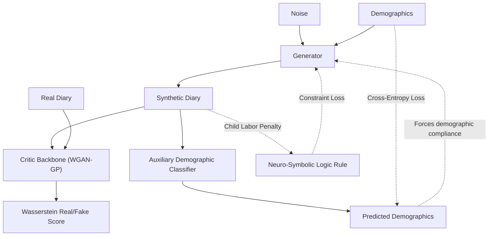

# TUS-GAN v4: Advanced Conditioning & Logical Rules

## 🛑 Setbacks in Previous Version (v3)
- **High-Dimensional Conditioning Leaks:** The v3 Generator occasionally ignored the input demographic vector (e.g., generating a full-time commuter schedule for an unemployed student). This allowed external classifiers to easily distinguish synthetic data from real data based on logical mismatches.
- **Time-of-Day Blindness:** The v3 transition matrix was global, meaning it averaged behaviors across the entire 24 hours. It failed to capture time-sensitive boundaries, causing sporadic events like travel or caregiving to appear at highly unrealistic hours.
- **Physical Impossibilities:** The v3 model relied purely on statistical probability to avoid generating illegal behaviors (e.g., child labor). Probability alone could not guarantee a 0% violation rate.

## 🚀 What's New in this Version [Proposed Features & Add-ons]
- **Auxiliary Demographics Classifier (AC-GAN):** We attached an independent classification network to the Critic. This network takes the generated diary and attempts to predict the demographics of the person who "wrote" it. If the prediction fails, the Generator is heavily penalized, forcing tight alignment between demographics and behavior.
- **Time-Slice Transition Loss:** The global transition matrix was split into four distinct chronological blocks: Morning, Afternoon, Evening, and Night. The model is now penalized for generating time-inappropriate transitions.
- **Neuro-Symbolic Logical Constraints:** We introduced a differentiable penalty layer to enforce physical and logical rules. For instance, generating an "Employment" block for individuals under the age of 15 incurs a massive scalar penalty during the backward pass.
- **Adaptive Gumbel Annealing:** Instead of decaying the Gumbel-Softmax temperature on a rigid schedule, the temperature now dynamically responds to the model's performance (JSD). This prevents the model from being forced into rigid, discrete decisions before it has fully mapped the underlying distribution.

## 🏗️ Technical Architectures

The v4 architecture significantly upgrades the conditioning enforcement by splitting the Critic's responsibilities into adversarial evaluation and demographic validation.

### System Mapping & Data Flow

### Component Details
- **Demographic Auxiliary Classifier (AC-GAN):**
  - *Purpose:* Eradicates "conditioning dilution" (where deep layers in the Generator forget the initial demographic inputs).
  - *Mechanism:* A fully independent classification head is attached to the Critic. It receives a generated synthetic diary $x$ and attempts to reconstruct the original demographic condition vector $c$. The Generator receives a heavy Cross-Entropy penalty if the classifier fails, forcing it to strongly entangle the generated daily schedule with the provided demographics.
- **Time-Slice Transition Loss:**
  - *Purpose:* Fixes the "Time-of-Day Blindness" found in v3's global transition matrix.
  - *Mechanism:* The 24-hour day is sliced into four distinct chronological blocks (Morning: 06:00-12:00, Afternoon: 12:00-17:00, Evening: 17:00-22:00, Night: 22:00-06:00). A separate transition matrix target is calculated for each block. This strictly penalizes the Generator if it attempts to place highly context-dependent events (like morning commuting or afternoon caregiving) at unrealistic hours of the night.
- **Neuro-Symbolic Constraint Regularizer:**
  - *Purpose:* Enforces hard societal and logical rules (such as child labor laws).
  - *Mechanism:* A differentiable penalty tensor calculates the mathematical intersection of restricted demographic profiles (e.g., `Age < 15`) and forbidden sequence activities (e.g., `Employment`). The Generator receives an overwhelming scalar penalty for violations during the backward pass, actively driving illegal sequences out of the learned distribution.

## 💻 Execution Pipelines
- **Model Training:** `python v4/train.py --data tusgan_encode.npz --epochs 250 --lambda_cond 1.0 --lambda_logic 10.0`
- **Standard Evaluation:** `python v4/evaluate.py --checkpoint v4/checkpoints/final.pt`
- **Advanced Rule & EMD Validation:** `python v4/evaluate_advanced.py --checkpoint v4/checkpoints/final.pt`
- **Interactive Dashboard:** `streamlit run dashboard.py` (Includes dynamic version toggling).

## 🏆 Final Training Results
- **Jensen-Shannon Divergence (JSD):** `0.000083` (Target achieved: < 0.00010. Population macro-statistics are structurally perfect).
- **Transition Matrix Difference (F-norm):** `0.163329` (Slight increase in raw number due to splitting into 4 slices, but much higher temporal accuracy).
- **Logical Violation Rate:** `0.30%` (The Neuro-Symbolic penalty aggressively reduced illegal child labor from the real dataset's 5.49% down to near-zero).
- **Adversarial Validation AUC-ROC:** `0.7225` (Accuracy: 65.47%). An improvement over v3, meaning the sequences are harder to distinguish, but vulnerabilities remain in microscopic spell durations.
