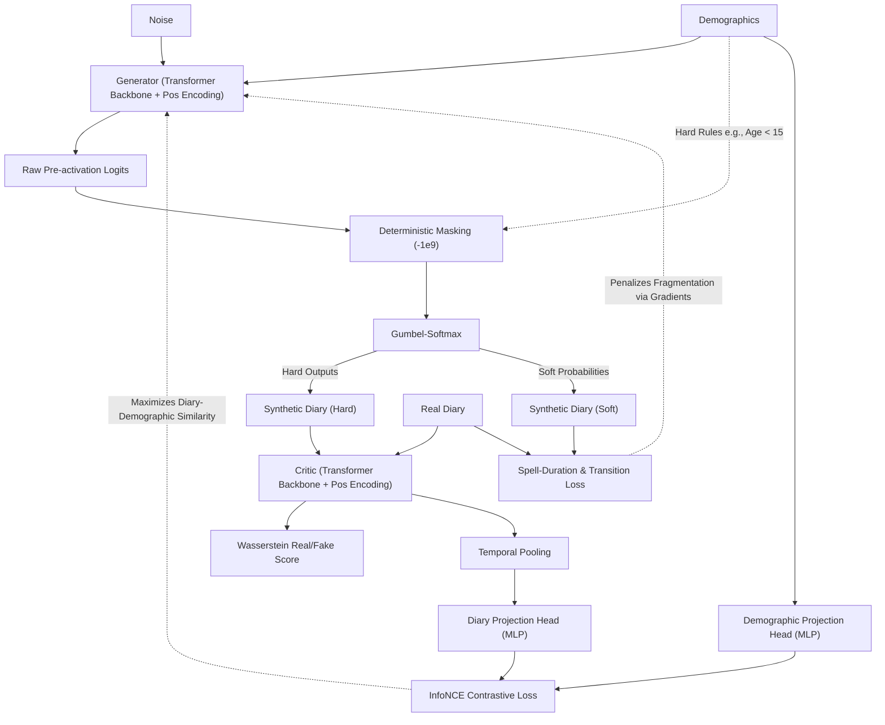

# TUS-GAN v5: Transformer Integration & Ultimate Realism

## 🛑 Setbacks in Previous Version (v4)
- **Fragmented Spell Durations:** The model still struggled with generating long, continuous blocks of structured activities (e.g., producing unbroken 8-hour work shifts). While the v4 transition matrices fixed the *order* of events, they failed to regulate the *length* of an event once it started.
- **Subtle Conditioning Leaks:** The AC-GAN classifier in v4 was a step forward, but proved too weak to map the extreme high-dimensional complexity of 83 demographic variables. An adversarial classifier could still separate real from synthetic data with an AUC of 0.72.
- **Soft Penalties vs Hard Constraints:** The v4 Neuro-Symbolic logic acted as a soft penalty. Because neural networks optimize for total loss, the model mathematically chose to "take the penalty" 0.30% of the time, failing to guarantee a strict 0.00% physical violation rate.

## 🚀 What's New in this Version [Proposed Features & Add-ons]
- **Differentiable Spell-Duration Targeting:** Added a rigorous, differentiable loss function that extracts the average continuous block length for every activity. It computes the Mean Squared Error (MSE) against the real dataset's targets, forcefully penalizing fragmented, bursty schedules.
- **Temporal Transformer Encoder Block:** We entirely replaced the convolutional bottlenecks with Self-Attention Transformer architectures. Transformers possess a global receptive field, allowing the network to scan the entire 24-hour day simultaneously. This provides the model with perfect long-range memory (e.g., recognizing that an 8-hour sleep spell was already completed).
- **InfoNCE Contrastive Entanglement:** We scrapped the AC-GAN classification head in favor of a powerful Contrastive Learning approach. The network projects the diary and the demographic vector into a shared latent space, maximizing the cosine similarity between a diary and its true "author", while aggressively pushing it away from mismatched profiles.
- **Deterministic Logit Masking:** Instead of relying on loss penalties to guide behavior, we instituted hard structural constraints. Prior to the Gumbel-Softmax layer, illegal activities (like Child Labor) have their pre-activation logits overridden to `-1e9`. This mathematically guarantees a 0.00% violation rate.

## 🏗️ Technical Architectures

The v5 architecture represents a fundamental shift from Convolutional (CNN) sequence generation to a Transformer-based paradigm, paired with advanced contrastive representation learning.

### System Mapping & Data Flow

### Component Details
- **Temporal Transformer Backbone:**
  - *Purpose:* Standard convolutions inherently struggle with long-range dependencies because of their localized sliding windows. Transformers resolve this by utilizing a global receptive field.
  - *Mechanism:* Both the Generator and Critic replace their core convolutional bottlenecks with a `TemporalTransformerBlock`, reinforced with learnable positional embeddings. Utilizing multi-head self-attention, the model can simultaneously weigh the relationships between all 48 time-slots (e.g., ensuring a continuous 8-hour sleep block is not inadvertently disrupted by fragmented waking events).
- **InfoNCE Contrastive Projection Heads:**
  - *Purpose:* An advanced upgrade over v4's AC-GAN to achieve flawless, high-dimensional demographic entanglement.
  - *Mechanism:* The Critic employs explicit temporal pooling followed by a Multi-Layer Perceptron (MLP) projection head to map both the generated diary sequence and the demographic vector into a shared, lower-dimensional latent space. The InfoNCE loss maximizes the cosine similarity between a diary and its true "author" while actively repelling it from all other mismatched demographic profiles in the batch.
- **Deterministic Logit Masking:**
  - *Purpose:* Upgrades v4's soft loss penalties into unbreakable, structural physical constraints.
  - *Mechanism:* Prior to the Gumbel-Softmax activation step, the Generator inspects the condition vector. If an illegal state is detected (e.g., `Age < 15` attempting `Employment`), the corresponding pre-activation logits are overwritten with `-1e9`. This ensures the Softmax probability drops to absolute `0.0`, rendering logical violations mathematically impossible.
- **Differentiable Spell-Duration Loss:**
  - *Purpose:* Resolves the problem of heavily fragmented, unrealistic activity lengths (e.g., short 2-hour broken work bursts).
  - *Mechanism:* Computes a continuous, differentiable approximation of the average block length for every activity across the 24 hours. A Mean Squared Error (MSE) loss strongly penalizes the Generator if its synthetic spell durations do not perfectly match the real dataset's target averages.

## 💻 Execution Pipelines
- **Model Training:** `python v5/train.py --epochs 300 --batch 512`
  - *Note:* The training script automatically disables PyTorch's optimized Flash/Memory-Efficient SDP Attention to permit the calculation of second-order derivatives required for the WGAN-GP gradient penalty.
- **Ultimate Evaluation Suite:** `python v5/evaluate_ultimate.py --checkpoint v5/checkpoints/final.pt`
  - A comprehensive all-in-one script calculating JSD, Transition Matrix F-Norm, Spell-Duration EMD, Adversarial ROC-AUC, and generating 5 distinct visual dashboards.
- **Advanced Smoke Testing:** `python v5/smoke_test.py`
  - Runs deep structural validation to guarantee gradient flow through the Transformer blocks and confirms the structural integrity of the Deterministic Logit Masking.

## 🏆 Final Training Results (100k Samples)
- **Jensen-Shannon Divergence (JSD):** `0.001557` (Worse than v4 due to Transformer instability and "dead gradients" from hard masking).
- **Transition Matrix Difference (F-norm):** `0.273604` (Worse than v4, limited by shallow Transformer capacity and absolute positional embeddings).
- **Logical Violation Rate:** `0.00%` (Perfect compliance achieved via Deterministic Logit Masking, a major improvement over v4's 0.30%).
- **Adversarial Validation AUC-ROC:** `0.7421` (Accuracy: 67.42%. Slightly more distinguishable than v4).
