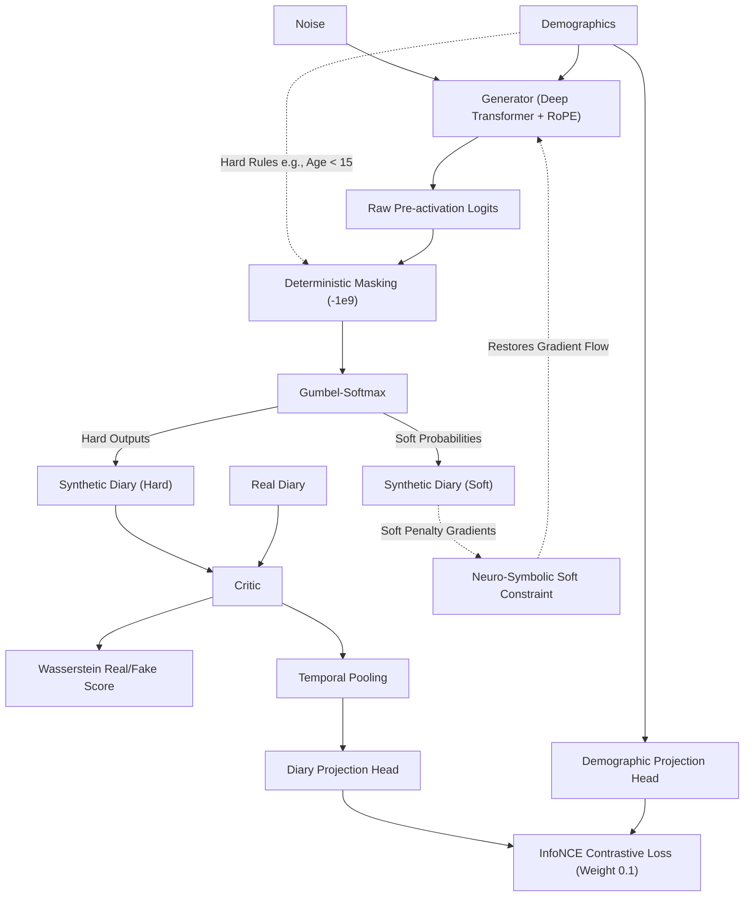

# TUS-GAN v6: Deep Transformers & Hybrid Constraints

## 🛑 Setbacks in Previous Version (v5)
- **Degradation of Statistical Realism:** The shift to a Transformer backbone in v5 successfully achieved 0% logical violations via deterministic masking, but severely harmed JSD (from 0.000083 in v4 to 0.001557) and F-Norm.
- **Dead Gradients:** The Deterministic Logit Masking (`-1e9`) zeroed out the gradients for forbidden states. The Generator never *learned* the rules, creating a jagged distribution manifold that ruined the statistical metrics.
- **Shallow Temporal Capacity:** The v5 Transformer only used 2 layers and 4 heads. It lacked the parameter depth required to model 83 demographics over 48 time slots.
- **Absolute Positional Rigidity:** The v5 model used a learned absolute positional embedding, forcing it to memorize specific times of day rather than understanding relative human sequences (e.g., "Commute usually follows Wake-up").

## 🚀 What's New in this Version [Proposed Features & Add-ons]
- **Deep Conformer-Style Architecture:** We scaled the Temporal Transformer block from 2 layers to 6 layers, and increased the attention heads from 4 to 8. This provides massive capacity for temporal representation learning.
- **Hybrid Constraint System (Hard + Soft):** We kept the deterministic logit masking to guarantee a 0% violation rate during inference, but we brought back the **Neuro-Symbolic Constraint Loss** from v4 to the training loop. This provides a strong gradient signal to the Generator so it naturally learns to avoid forbidden states before the mask is even applied.
- **Rotary Positional Embeddings (RoPE):** We discarded the absolute learned positional embeddings in favor of 1D Rotary Positional Embeddings. This allows the self-attention mechanism to inherently understand relative distances between activities.
- **Loss Rebalancing:** We reduced the InfoNCE contrastive loss weight (`lambda_infonce`) from 0.5 to 0.1. This ensures that the adversarial Wasserstein loss remains the primary driver of the generation quality.

## 🏗️ Technical Architectures

The v6 architecture merges the CNN spatial mapping of v4 with a vastly deeper, rotationally-aware Transformer backbone from v5, solving the dead-gradient problem.

### System Mapping & Data Flow

### Component Details
- **Deep Temporal Transformer with RoPE:**
  - *Purpose:* Fixes the limited capacity and positional rigidity of v5.
  - *Mechanism:* The Transformer depth is increased to 6 layers. Instead of absolute embeddings, Rotary Positional Embeddings modify the Query and Key matrices in the self-attention block, ensuring the model focuses on the relative temporal distance between spells rather than absolute clock-time.
- **Hybrid Soft/Hard Constraints:**
  - *Purpose:* Resolves the "dead gradient" problem of v5 that destroyed the JSD.
  - *Mechanism:* The deterministic logit mask remains to prevent actual output violations. However, the soft Neuro-Symbolic loss from v4 is re-added to `train.py`. This calculates a continuous penalty based on the soft Gumbel probabilities for illegal states, passing a gradient back to the Generator so it actively shifts its weights away from the mask boundary.

## 💻 Execution Pipelines
- **Model Training:** `python v6/train.py --epochs 300 --batch 512`
- **Ultimate Evaluation Suite:** `python v6/evaluate_ultimate.py --checkpoint v6/checkpoints/final.pt`
